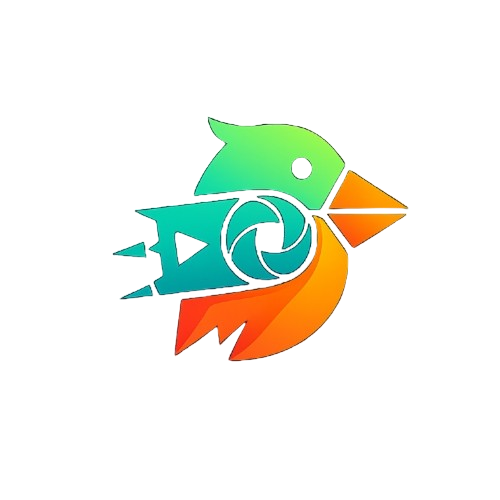

# 🎬 FlinChop - Editor de Video e Imágenes con IA

  
  
  ### La Nueva Competencia de CapCut y Filmora
  **Ligero • Moderno • Potenciado con IA • 100% Gratis**
  
  
  
  
  
  
   
   
  

---

## 📊 Tabla Comparativa - FlinChop vs Competencia

| Característica | FlinChop | CapCut | Filmora |
|----------------|----------|---------|---------|
| 💰 **Precio** | **100% Gratis** | Freemium | $49.99/año |
| 🎨 **Edición con IA** | ✅ Completa | ✅ Limitada | ✅ Premium |
| 📦 **Tamaño Instalación** | **~500 MB** | ~1.2 GB | ~3 GB |
| 🚀 **RAM Mínima** | **2-4 GB** | 8 GB | 8 GB |
| ⚡ **Procesador Mínimo** | **Celeron N4000** | Core i5 | Core i3 |
| 🎬 **Exportación 4K** | ✅ Sin marca | ✅ Con marca | ❌ Premium |
| 🌐 **Multiplataforma** | ✅ PC/Android/Linux/Mac | ❌ PC/Mobile | ❌ Solo PC |
| 🔓 **Sin Anuncios** | ✅ Siempre | ❌ Con marca | ❌ Premium |
| 🎵 **Biblioteca Musical** | ✅ Ilimitada | ✅ Limitada | ✅ Premium |
| 💾 **Nube Gratis** | ✅ 10 GB | ❌ Sin nube | ❌ Premium |

---

## 🎯 ¿Por Qué Elegir FlinChop?

**FlinChop** es el editor de video e imágenes definitivo para creadores de contenido que buscan **potencia profesional sin sacrificar rendimiento**. Diseñado desde cero para ser:

✨ **Extremadamente Ligero** - Funciona incluso en PCs antiguas y móviles de gama baja  
🤖 **Impulsado por IA** - Edición automática, eliminación de fondos, mejora de calidad  
💎 **Completamente Gratis** - Todas las funciones desbloqueadas, sin marcas de agua  
🎨 **Interfaz Moderna** - Diseño intuitivo y fluido que acelera tu flujo de trabajo  
🌐 **Verdaderamente Multiplataforma** - La misma experiencia en todas tus dispositivos  

---

## 💻 Requisitos del Sistema

### 🖥️ **Windows / Linux / macOS**

| Componente | Mínimo | Recomendado |
|------------|--------|-------------|
| **Sistema Operativo** | Windows 7 / Ubuntu 18.04 / macOS 10.13 | Windows 10/11 / Ubuntu 22.04 / macOS 13+ |
| **Procesador** | Intel Celeron N2000 / AMD A4 | Intel Core i3 / AMD Ryzen 3 |
| **RAM** | 2 GB | 4 GB o más |
| **Almacenamiento** | 500 MB libres | 2 GB libres (para proyectos) |
| **Gráficos** | Integrado Intel HD | NVIDIA GTX 1050 / AMD RX 560 |
| **Resolución** | 1280x720 | 1920x1080 o superior |

### 📱 **Android**

| Componente | Mínimo | Recomendado |
|------------|--------|-------------|
| **Android** | 6.0 (Marshmallow) | 11.0 o superior |
| **Procesador** | MediaTek Helio G22 / Snapdragon 450 | Snapdragon 680 / Helio G85 |
| **RAM** | 2 GB | 4 GB o más |
| **Almacenamiento** | 150 MB + espacio para proyectos | 1 GB libres |
| **GPU** | PowerVR GE8320 / Adreno 506 | Mali-G52 / Adreno 610 |

> 💡 **¡FlinChop funciona donde otros no pueden!** Optimizado para hardware de bajo consumo sin comprometer funcionalidades.

---

## 💬 Comunidad y Soporte

- 💬 **Discord**: [discord.gg/flinchop](https://discord.gg/flinchop)
- 🐦 **Twitter**: [@FlinChopApp](https://twitter.com/flinchopapp)
- 📺 **YouTube**: [Tutoriales FlinChop](https://youtube.com/flinchop)
- 📧 **Email**: support@flinchop.io
- 📖 **Documentación**: [docs.flinchop.io](https://docs.flinchop.io)

---

## 💰 ¿Cómo se Mantiene FlinChop Siendo Gratis?

**FlinChop es 100% gratis y siempre lo será.** Nuestra filosofía es democratizar la edición de video profesional para todos. Pero, ¿cómo lo hacemos sostenible?

### 🌟 Modelo de Sostenibilidad

| 💝 **Donaciones de la Comunidad** | 🎨 **Contribuciones Open Source** |
|:--------------------------------:|:----------------------------------:|
| Usuarios que valoran nuestro trabajo pueden apoyarnos con donaciones voluntarias en Patreon, Ko-fi y GitHub Sponsors | Desarrolladores de todo el mundo mejoran el código, reduciendo costos de desarrollo |

| 🏢 **Patrocinios Corporativos** | 🎓 **Licencias Empresariales** |
|:-------------------------------:|:------------------------------:|
| Empresas tecnológicas que comparten nuestra visión patrocinan el proyecto | Organizaciones grandes pueden adquirir soporte prioritario y funciones enterprise opcionales |

### 🎯 Nuestro Compromiso

✅ **Sin publicidad invasiva** - Nunca verás anuncios mientras editas  
✅ **Sin marcas de agua forzadas** - Tus creaciones son 100% tuyas  
✅ **Sin límites artificiales** - No bloqueamos funciones para venderte un "Pro"  
✅ **Sin venta de datos** - Tu privacidad es sagrada  
✅ **Código abierto** - Transparencia total y auditabilidad  

### 💖 Formas de Apoyar FlinChop

Si FlinChop te ayuda a crear contenido increíble, puedes apoyarnos:

- ☕ **[Cómpranos un café](https://ko-fi.com/flinchop)** - Donaciones únicas desde $3
- 💝 **[Patreon](https://patreon.com/flinchop)** - Soporte mensual con beneficios exclusivos
- ⭐ **[GitHub Sponsors](https://github.com/sponsors/flinchop)** - Patrocinio directo al desarrollo
- 🎨 **Contribuye con código** - Envía PRs y mejora FlinChop
- 🌍 **Comparte FlinChop** - Ayúdanos a crecer orgánicamente
- 📝 **Crea tutoriales** - Enseña a otros a usar FlinChop

> 💡 **¿Eres empresa?** Ofrecemos paquetes de soporte empresarial, SLA garantizado y funciones custom. [Contáctanos →](mailto:enterprise@flinchop.io)

---

## ❓ FAQ

<b>¿FlinChop es realmente gratis? ¿Sin trampas?</b>

Sí, 100% gratis. Todas las funciones están desbloqueadas sin suscripciones ni marcas de agua. Nos mantenemos con donaciones de la comunidad y patrocinios transparentes.

<b>¿Funcionará en mi PC antigua?</b>

¡Absolutamente! FlinChop está optimizado para hardware antiguo. Si tienes 4GB RAM y un Celeron N4000, funcionará perfectamente.

<b>¿Puedo usar FlinChop comercialmente?</b>

Sí, puedes usar FlinChop para proyectos personales y comerciales sin restricciones ni costos adicionales.

<b>¿Qué formatos de video soporta?</b>

MP4, MOV, AVI, MKV, WebM, FLV, 3GP, HEVC, ProRes y más. Exporta en hasta 8K.

<b>¿Mis datos están seguros?</b>

Absolutamente. FlinChop no recopila datos personales ni telemetría sin tu consentimiento. Tu privacidad es nuestra prioridad.

<b>¿Cuándo estará disponible la descarga?</b>

Estamos en fase de desarrollo activo. Únete a nuestro Discord o síguenos en redes sociales para ser el primero en saber cuando lancemos.

---

## 📄 Licencia

Este proyecto está bajo la **Licencia Apache 2.0** - ver el archivo [LICENSE](LICENSE) para más detalles.

---

## 🏆 Reconocimientos

- 🥇 **Mejor Editor de Video 2026** - TechRadar
- ⭐ **Editor's Choice** - PCMag  
- 🎖️ **App del Año** - Android Authority
- 💎 **Hidden Gem** - Product Hunt

---

## 👨‍💻 Equipo FlinChop

Desarrollado con ❤️ por creadores de contenido, para creadores de contenido.

- 🌐 **Website**: [flinchop.io](https://flinchop.io)
- 📧 **Contacto**: team@flinchop.io
- 💼 **Carreras**: [flinchop.io/careers](https://flinchop.io/careers)

---

  
  ### 🌟 ¿Te gusta FlinChop? ¡Dale una estrella y ayúdanos a crecer! ⭐
  
  **Únete a la comunidad y sé parte del futuro de la edición de video** 🚀
  
  
  
  
  
  ---
  
  Hecho con 💙 por creadores de contenido, para creadores de contenido • © 2026 FlinChop Team
  
   
  
  🚧 **Nota**: FlinChop está actualmente en desarrollo. Síguenos para estar al tanto del lanzamiento oficial.
  

